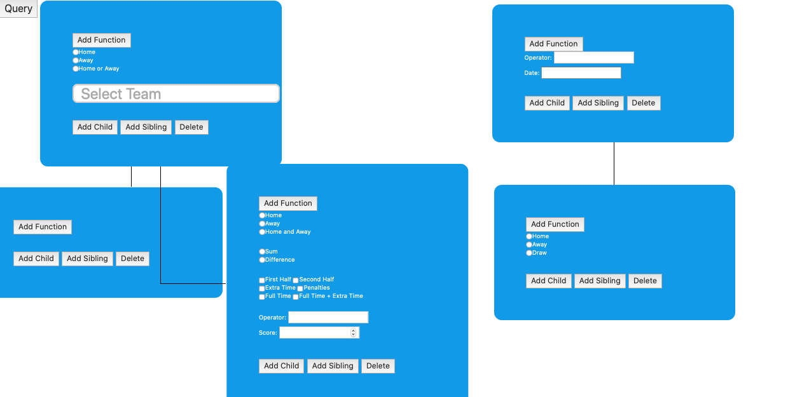
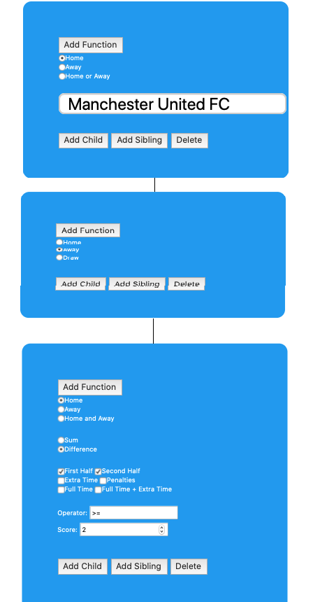
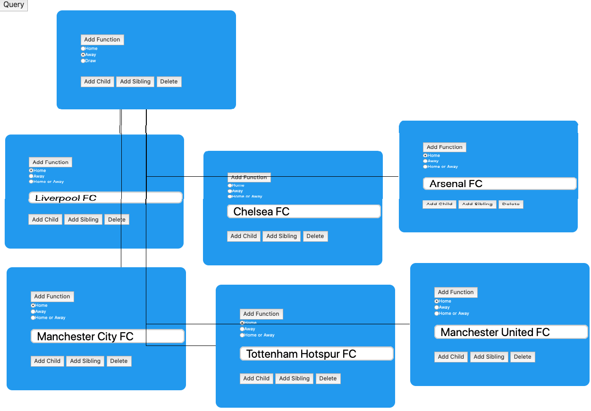
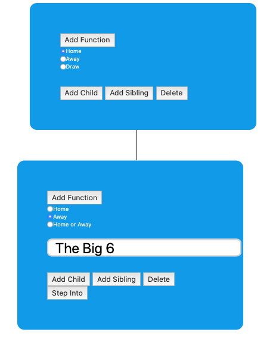

# Universal Query System

## Description
The Universal Query System (UQS) is based of the fundamentals of Turing's Universal Turing machine. With the idea that give a baseline set of *functions* users can create *queries* made up of *functions* and *complex functions* which are converted into SQL commands.

Using these baseline *functions* users can create *complex functions* to model *queries*. They can then build upon past user-defined complex function to model even more complex queries simply.

The idea behind the UQS is to give a tool to those who ***know what to ask but not how to ask it***. Given a large database, there are those (technical users) who know how the database is laid out, and have the technical knowledge to interrogate it, but not the formal knowledge of how to ask the right questions, this process however is not easy as it requires complex communication between two separate entities where a miscommunication results in inaccurate data.

The UQS not only automates that process, but allows users to build off the work of past users to ask more complex questions in a simpler fashion. Similar to how the ability to use open source libraries cuts down on the time for a user to create a complex program.

## Example
Think of a simple ISA with an instruction for addition but no instruction for multiplication. A user can then create multiplication by doing repetitive addition. Another user comes along and creates exponents by doing repetitive multiplication. This user does not know, nor should they need to know that the *function* multiplication is in fact made up of additions, this is abstracted from the user. 

All future users may then use exponents, addition, and multiplication easily in their math without having to know the complex functionality of each function is represented.

## Terminology
I will use terms like **function**,  **complex function** and  **queries**. Using the above example, think of a *function* as addition, a *complex function* as multplication/exponents, and a *query* as the math.

The confusion arises as all 3, are very similar, for instance multiplication is a *complex function*, as it is made up of multiple *functions*, however when multiplication is used to create the *complex function* exponent, I would refer to multiplication as a *function*, this is because in this state, the complexity of how multiplication works is abstracted to us.

A user can create a *complex function* by putting together multiple *functions* (and even other *complex functions*) it only becomes a *query* when it is executed.

The use of the term "complex query" is no different than a query, it is simply to confer the notion of its expressiveness (the joke here is how verbose I made this sentence). For instance if you asked someone "How was your day?", I would simply refer to this as a query, while asking "What did you do with your mom, on August 17th, after the baseball game?" as a complex query.
 
## Use case
I am implementing this idea using my database of soccer data, however theoretically this could be used on any dataset given the proper set of baseline functions created could model all type of queries for that dataset.

Using this system: journalists, statheads, and every day users can find the answer to complex questions like "Find all games where Arsenal played away from home AND got a red card in the first half AND won the game"
# How it works
The idea here is to make the system as user-friendly as possible, this should be usable by non-technical users. However I am not a front end designer so this has proven to be extremely difficult.

## Schema

Functions are displayed by the blue boxes. Lines connecting functions outlines a parent child relationship which means AND. As you can see the two blue boxes at the top are not connected by any lines, this outlines an OR relationship.

Above is an example of an actual query, so lets explain what this is saying. "Find games where Manchester United played at home AND the away team won AND the home team scored 2 or more goals in the 2nd half than they did in the 1st half."

This query resolves to 2 results, Manchester United vs Blackburn Rovers in 2011 (2-3) and vs Tottenham 2012 (2-3).

Imagine how long this would take for a non-technical user to find this out, or even for a technical user to construct the query to model this.

## Complex Query
A common term in the premier league is "the big 6" which refers to the 6 most popular teams in the premier league. Using the current baseline functions provided it would be very difficult to make a query involving those teams, here is an example of how the query "Find games where the big 6 played at home AND lost" would be modelled.

This is extremely messy as it really models "Find games where the away team won AND (Liverpool played at home OR Tottenham played at home OR Arsenal played at home ...)"

Two possible solutions to this would be: one having a better ui or two creating and giving the users an option to query just the big 6.

To option 1, I am not a good front end designer and even if I were this would only cure the symptom and not the disease. To the second option making a new option and expanding the base set of functions is a slippery slope and defeats the purpose of the UQS. The optimal solution is to allow users to collapse the OR functions into one complex function.

Not only is this cleaner but future users may now use this complex function in any past or future queries to clean up the number of functions their query requires. (The step into button allows a user to "step into" a complex function to see how it is made and make any modification, for instance if someone wanted to make this query on the big 6 minus Tottenham).

## Interoperability
Lets re-visit the query shown above "Find games where Manchester United played at home AND the away team won AND the home team scored more 2 or more goals in the 2nd half than they did in the 1st half." This query is modeled by the system with the following JSON structure.

    {
	   "level":0,
	   "parent":null,
	   "id":"root",
	   "function":"",
	   "children":[
	      {
	         "level":1,
	         "id":1,
	         "function":"games_by_team",
	         "children":[
	            {
	               "level":2,
	               "id":2,
	               "function":"games_by_score",
	               "children":[
	                  {
	                     "level":3,
	                     "id":3,
	                     "function":"games_by_result",
	                     "children":[
	                        
	                     ],
	                     "result":[
	                        
	                     ],
	                     "params":{
	                        "result":"away"
	                     }
	                  }
	               ],
	               "result":[
	                  
	               ],
	               "params":{
	                  "period":[
	                     "first_half",
	                     "second_half"
	                  ],
	                  "homeaway":"home",
	                  "operation":"difference",
	                  "operator":">=",
	                  "score":"2"
	               }
	            }
	         ],
	         "result":[
	            
	         ],
	         "params":{
	            "homeaway":"home",
	            "team":"Manchester United FC"
	         }
	      }
	   ],
	   "result":[
	      
	   ],
	   "params":{
	      
	   }
	}
This is sent to the api, which uses the function name to parse the parameters to place and build an SQL query. Using this json structure, it is trivial to save and recreate past queries, which is the science behind how complex functions work.

## Building the SQL queries
Converting the JSON schema shown above into an accurate SQL query is the most difficult and important step in the UQS. This is where the simplicity of the base set of functions places a pivotal factor. The more features you add to a function (like adding a Big 6 option) the more complex your SQL query becomes, making it harder to be made uniform.

There is no real science behind this process, but I will still attempt to break it down.

 1. Define the specs of the function: what can it do, what can't it do
 2. Once you know what it CAN do, write out all the possible things one could ask using your function
 3. Convert each one of these into SQL, and identify the points in common, if there are not many perhaps your function is doing too much, or maybe you could rewrite one query to appear similar to another. This will allow you to create a uniform query, with variables in spots that are to be provided by a user.
 4. Lots and lots of if statements

Lets first look at an easy function **Games by Result** the uniform query for this is simply: "SELECT match_id FROM games WHERE result = [Home/Draw/Away]"

A more complex example is  **Games by Score**, which is explained best by looking at the function on line 20 of /api/Query-Handler/Query.php and its helper functions in /api/Query-Handler/match_by_score.php.

# Future Development
Below outlines what I will plan to continue to work on going forward to finish development of the first implementation of the UQS.
## Speed
One major issue is the speed in which it takes to make a query, which runs between instant to several minutes. This is due to a multitude of factors.

 1. All functions query against the ENTIRE database, meaning if you queried "find all games where Manchester United played at home AND scored more than 2 goals". The first function returns all games where Man U played at home, and the second function returns ALL games where more than 2 goals were scored by the home team, and then a union is performed.
 2. By making every SQL query uniform, occasionally speed advantages like indexes are not being taken advantage of.
 3. Re-queries of known information, if a user uses a complex query, all the functions making it up are re-queried, despite the result already being known.
 4. My 2012 MacBook Pro does not make for a great MySQL database for a database of 60gb.

Hypothosized solutions for this are such.

 1. Rather than have all queries query on the whole database, queries in an AND relationship should query on TEMP tables. Have the first function query the whole database and have its results in a TEMP table, in which the next function queries on and so on. Stats on query time and rows returned are key on all functions, therefore I can chose the function that runs the fastest and returns the least amount of rows to be the first function to run and query on the full database to increase time saved.
 2. Not much to do here, but make a better schema which may not be worth the time gain if the above and below ideas work.
 3. Functions and complex functions use a JSON schema which is encoded in Base64 to allow it to be easily re-used. Potentially I could hash this Base64 encoding, (or simply the json object) along with the rows it returned and store that into database, therefore we never run a function that has already been computed. If this turns out to be too much space/too slow we could allow the user to save this or select information in local storage.
 4. Get a new computer/move to a fast server

 ## Quality of Life changes
The block building system needs to be as seamless as possible, placing blocks building relationships must be easy to do and clear as to the result.

Functions need to be modified to become more simple/hide more advance features.

Expand on the base set of functions so that every query is possible, I'm currently missing the ability to make queries based on the timing of a specific game event or consecutive events.

Blocks need to have knowledge of other blocks, what I mean by this is I want to add to the Games by Result block to work with the Games by Team block. Rather than return games where the result was a home/away win or draw, you should be able to specify show me games where the team specified in the Games by Team block won (regardless of if they were home or away)
